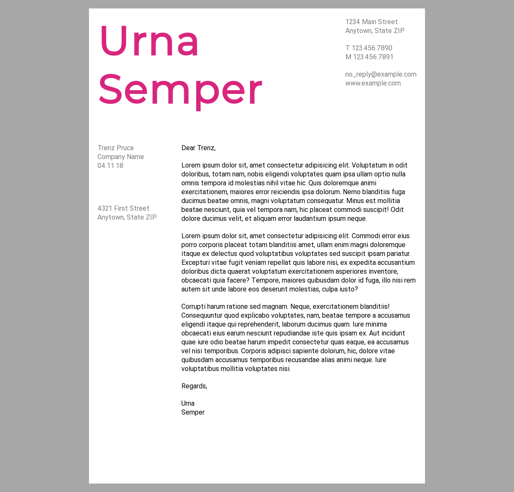
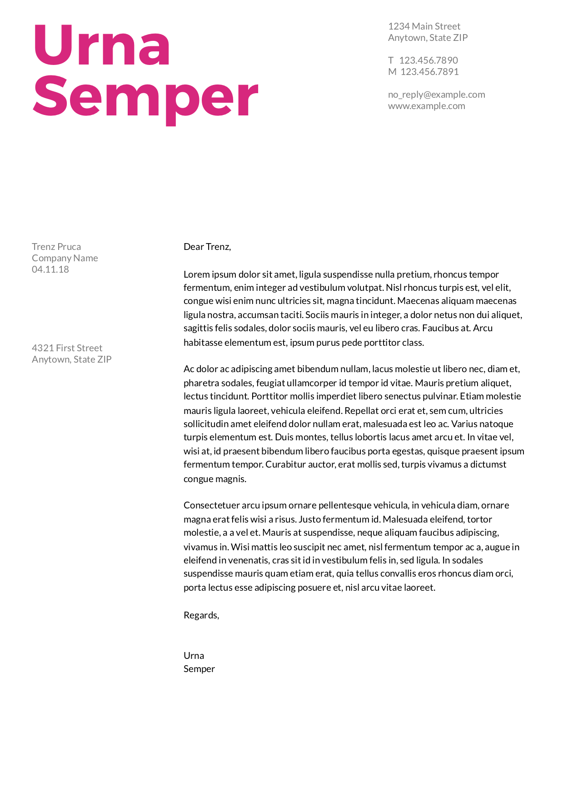

# Letter Layout

This webpage was created by Stefan Klinkusch at Digital Career Institute in Berlin, Germany using HTML and CSS.

## Features

It features
- semantic HTML (header, nav, footer, main, article, section, aside)
- webfonts
- importing CSS subfiles into a main CSS
- floats

## Screenshot

## Original Task
### Creating a Letter Exercise

Create a letter using all your knowledge that you collected over the last weeks (use semantic tags).

### Info

- Heading:

  - Font: Montserrat
  - Color: #D8267D

- Text:

  - Font: Lato
  - Color: #000000, #7A7A7A
